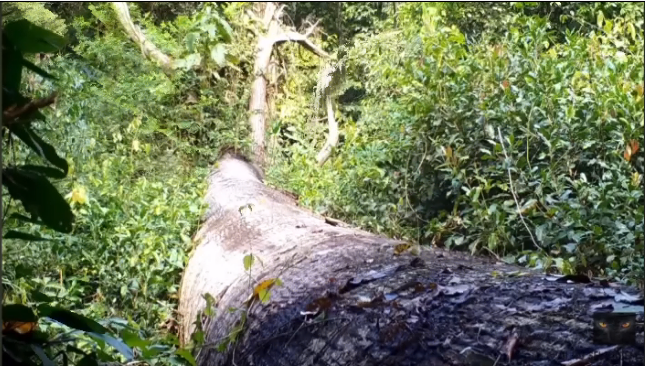

# Remoção do plano de fundo de vídeos usando k-means

### Autor: Carlos Eduardo de Schuller Banjar

## Utilização

### Linux

```
git clone https://github.com/carloseduardobanjar/comp-cientifica.git
```

Coloque um vídeo intitulado "video.mp4" dentro da pasta do repositório clonado e rode o comando

```
python3 main.py
```

## Metodologia

### 1. Coleta de Amostras

Para iniciar o processo de reconhecimento do plano de fundo em vídeos, coletamos 20 frames aleatórios do vídeo em questão.

### 2. Análise de Cores por Pixel

Para cada pixel em cada frame selecionado, registramos as cores que ele assume nos 20 frames. Isso resulta em um conjunto de dados que representa a variação das cores ao longo dos frames.

#### 3. Clusterização usando K-Means

Utilizamos o algoritmo K-Means para agrupar as cores registradas em dois clusters distintos. Este passo tem como objetivo separar as cores associadas ao plano de fundo das relacionadas ao objeto em movimento.

### 4. Identificação do Cluster de Fundo

Determinamos qual cluster contém mais elementos, considerando-o como o cluster associado ao plano de fundo. O outro cluster é associado ao objeto em movimento.

### 5. Estimativa da Cor de Fundo

No cluster identificado como plano de fundo, calculamos a mediana das cores para os canais R (vermelho), G (verde) e B (azul). Essa mediana representa a cor característica do plano de fundo.

### 6. Criação do Frame de Fundo

Criamos um novo frame com todos os pixels associados ao plano de fundo, estimados na etapa anterior.

### 7. Subtração do Fundo

Subtraímos o frame de fundo de cada frame original para obter o objeto em movimento. O resultado é um novo conjunto de frames em que apenas o objeto em movimento é preservado.

## Resultado

### Plano de fundo:



### Vídeo original:

[Vídeo original](video.mp4)

### Vídeo com o plano de fundo removido:

[Vídeo com o plano de fundo removido](foreground.mp4)
