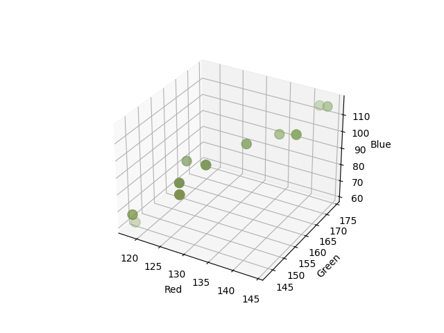

# Remoção do plano de fundo de vídeos usando k-means

### Autor: Carlos Eduardo de Schuller Banjar

## Utilização

### Linux

```
git clone https://github.com/carloseduardobanjar/comp-cientifica.git
```

Coloque um vídeo intitulado "video.mp4" dentro da pasta do repositório clonado e rode o comando

```
python3 main.py
```

## Introdução

Esse tema foi escolhido para o projeto final da disciplina, porque o K-Means faz parte dos algoritmos que envolvem processos iterativos de otimização, assim como o gradiente descendente que vimos. O K-means é um algoritmo de agrupamento utilizado em aprendizado não supervisionado para dividir um conjunto de dados em clusters. O objetivo é minimizar a variação intra-cluster, ou seja, a soma das distâncias quadráticas entre os pontos de dados e o centróide de seu cluster atribuído. Os centróides são ajustados iterativamente até que a convergência seja alcançada, como é possível ver no gif abaixo, retirado do [Wikipédia](https://en.m.wikipedia.org/wiki/File:K-means_convergence.gif).


## Metodologia

### 1. Coleta de amostras

Para iniciar o processo de reconhecimento do plano de fundo em vídeos, coletamos 20 frames aleatórios do vídeo em questão.

Iremos demonstrar a metodologia aplicada a dois pixels, circulados em amarelo e vermelho.


### 2. Análise de cores por pixel

Para cada pixel em cada frame selecionado, registramos as cores que ele assume nos 20 frames. Isso resulta em um conjunto de dados que representa a variação das cores ao longo dos frames.

Cores assumidas pelo pixel em vermelho:




Cores assumidas pelo pixel em amarelo:


### 3. Clusterização usando K-Means

Utilizamos o algoritmo K-Means para agrupar as cores registradas em dois clusters distintos. Este passo tem como objetivo separar as cores associadas ao plano de fundo das relacionadas ao objeto em movimento.


### 4. Identificação do cluster de fundo

Determinamos qual cluster contém mais elementos, considerando-o como o cluster associado ao plano de fundo. O outro cluster é associado ao objeto em movimento.

### 5. Estimativa da cor de fundo

No cluster identificado como plano de fundo, calculamos a mediana das cores para os canais R (vermelho), G (verde) e B (azul). Essa mediana representa a cor característica do plano de fundo.


### 6. Criação do frame de fundo

Criamos um novo frame com todos os pixels associados ao plano de fundo, estimados na etapa anterior.

### 7. Subtração do fundo

Subtraímos o frame de fundo de cada frame original para obter o objeto em movimento. O resultado é um novo conjunto de frames em que apenas o objeto em movimento é preservado.

## Resultados

### Um exemplo

#### Vídeo original:


#### Plano de fundo:


#### Vídeo com o plano de fundo removido:


### Outro exemplo... menos emocionante

#### Vídeo original:


#### Plano de fundo:


#### Vídeo com o plano de fundo removido:


## Conclusão

A aplicação do algoritmo K-means para remoção de plano de fundo em vídeos apresentou resultados satisfatórios em situações dinâmicas, onde o objeto de interesse, no caso um animal, está em constante movimento. O método foi capaz de capturar não apenas o objeto em movimento, mas também outros elementos dinâmicos da cena, como folhas balançando com o vento, demonstrando a sensibilidade do K-means.

No entanto, observou-se uma limitação quando o animal para de se movimentar. Nesses momentos, o objeto parado foi erroneamente reconhecido como parte do plano de fundo.

Assim, o sucesso do método de remoção de plano de fundo usando o algoritmo K-means depende de várias características do vídeo, como

1. Movimento do objeto;
2. Contraste entre objeto e plano de fundo;
3. Iluminação fixa;
4. Câmera estática.

## Tecnologias

- Python
- scikit-video
- numpy
- random
- numba
- scikit-learn
- tqdm
